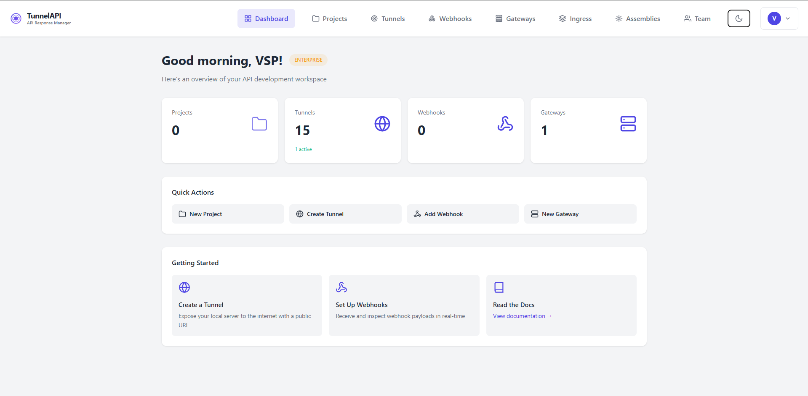
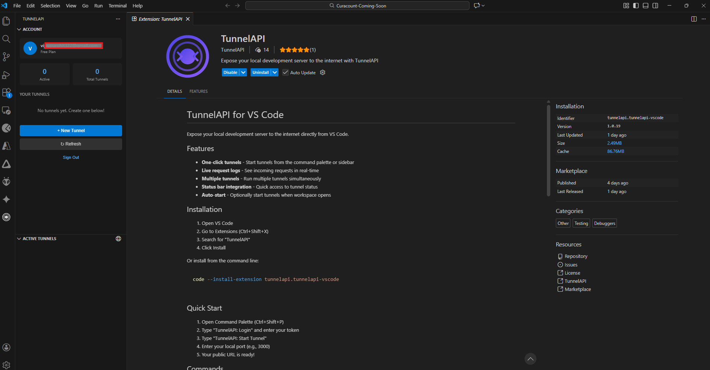

<div align="center">


# TunnelAPI

**Expose your localhost to the internet with secure tunnels**

[](https://tunnelapi.in)
[](https://docs.tunnelapi.in)
[](https://marketplace.visualstudio.com/items?itemName=TunnelAPI.tunnelapi-vscode)

[](https://www.npmjs.com/package/api-response-manager)
[](https://www.npmjs.com/package/api-response-manager)
[](https://github.com/tunnelapi/vscode-extension/blob/main/LICENSE)

</div>

---

## 🚀 What is TunnelAPI?

TunnelAPI is a developer-first tunneling platform that lets you expose your local development server to the internet securely. Perfect for:

- 🔗 **Webhook Testing** - Receive webhooks from Stripe, GitHub, Twilio, etc.
- 🌐 **API Development** - Share your local API with teammates or clients
- 📱 **Mobile Testing** - Test your app on real devices
- 🎯 **OAuth Callbacks** - Handle OAuth redirects during development
- 🤝 **Client Demos** - Show work-in-progress to stakeholders

<div align="center">

```
┌──────────────────────────────────────────────────────────────────┐
│  ● ● ●                      Terminal                             │
├──────────────────────────────────────────────────────────────────┤
│                                                                  │
│  $ arm tunnel 3000 -s myapp                                      │
│                                                                  │
│  ✓ Tunnel created successfully!                                  │
│    Public URL: https://myapp.free-tunnelapi.app                  │
│    Local Port: 3000                                              │
│                                                                  │
│  ℹ Forwarding traffic...                                         │
│                                                                  │
└──────────────────────────────────────────────────────────────────┘
```

</div>

## ✨ Features

| Feature | Description |
|---------|-------------|
| 🔒 **Secure Tunnels** | End-to-end encrypted connections with SSL/TLS |
| 🏷️ **Custom Subdomains** | Get memorable URLs like `myapp.free-tunnelapi.app` |
| 🌐 **API Gateway** | Route, transform, and manage API traffic |
| ☸️ **K8s Ingress** | Kubernetes-style ingress rules for advanced routing |
| 🪝 **Webhook Endpoints** | Dedicated endpoints with request logging & replay |
| 📊 **Real-time Analytics** | Monitor requests, latency, and errors |
| 🔄 **Visual Workflow Builder** | Drag-and-drop API orchestration |

## 📦 Installation

### Option 1: npm (Recommended)

```bash
npm install -g api-response-manager
```

### Option 2: Download Binary

Download the standalone binary for your platform:

| Platform | Architecture | Download |
|----------|--------------|----------|
| **Windows** | x64 | [arm-win-x64.exe](https://tunnelapi.in/downloads/arm-win-x64.exe) |
| **Linux** | x64 | [arm-linux-x64](https://tunnelapi.in/downloads/arm-linux-x64) |
| **macOS** | x64 (Intel) | [arm-macos-x64](https://tunnelapi.in/downloads/arm-macos-x64) |
| **macOS** | ARM64 (Apple Silicon) | [arm-macos-arm64](https://tunnelapi.in/downloads/arm-macos-arm64) |

[View all downloads →](https://tunnelapi.in/download)

### Option 3: VS Code Extension

Install directly from the marketplace:
- [VS Code Marketplace](https://marketplace.visualstudio.com/items?itemName=TunnelAPI.tunnelapi-vscode)
- [Open VSX Registry](https://open-vsx.org/extension/tunnelapi/tunnelapi-vscode)

## 🚀 Quick Start

```bash
# Login to your account
arm login

# Start a tunnel on port 3000
arm tunnel 3000

# Start with custom subdomain
arm tunnel 3000 -s myapp

# View all commands
arm --help
```

## 📸 Screenshots

### Dashboard


### Visual Workflow Builder


### VS Code Extension


## 📚 Resources

- 🌐 [Website](https://tunnelapi.in)
- 📖 [Documentation](https://docs.tunnelapi.in)
- 💻 [VS Code Extension](https://github.com/tunnelapi/vscode-extension)
- 📥 [CLI Downloads](https://tunnelapi.in/download)
- 📥 [System Binary Downloads](https://tunnelapi.in/download)

## 🤝 Connect

- 📧 Email: [info@tunnelapi.in](mailto:info@tunnelapi.in)
- 🐛 Issues: [GitHub Issues](https://github.com/tunnelapi/vscode-extension/issues)

---

<div align="center">

**Built with ❤️ for developers**

© 2025 TunnelAPI by Vijay Singh Purohit

</div>
